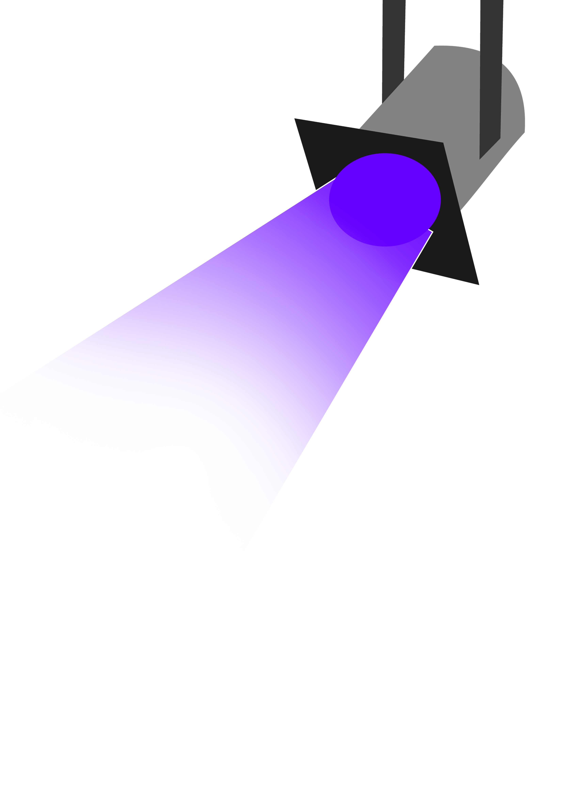

## Hello World! 👾

I'm a software development student who does freelance as game developer on my free time.

#### Tech stack:

<strong>Programming Languages</strong>

  

      
      
      
      
      
      
  

<strong>Database</strong>

  <blockquote>
    

    
Relational

      

          
          
      

    

  </blockquote>
  <blockquote>
    

    
Non-Relational

      

          
      

    

  </blockquote>

<strong>Frameworks</strong>

  <blockquote>
    

    
CSS

      

          
          
          
          
      

    

  </blockquote>
  <blockquote>
    

    
Web

      

          
          
          
          
      

    

  </blockquote>

<strong>Others</strong>

  

      
      
  

#### More about me:

  
  
  

  

  

<!-- Design inspired by Iuricode -->
